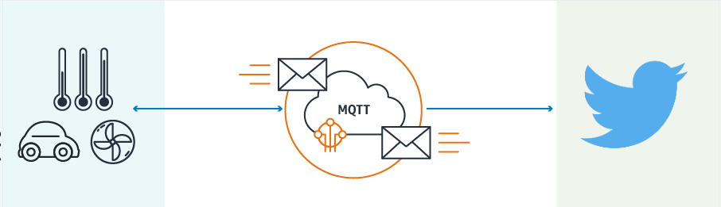

# AWS IoT - Twitter Bridge for AWS Serverless Application Repository

This service provides a bridge between AWS IoT and Twitter for your devices to tweet messages directly to Twitter.



## Table of Contents
* **[What is AWS Serverless Application Repository?](#what-is-aws-serverless-application-repository)**
* **[Use Cases](#use-cases)**
* **[Prerequisites](#prerequisites)**
* **[Setup](#setup)**
* **[Use](#use)**
* **[License](#license)**

## What is AWS Serverless Application Repository?
The [AWS Serverless Application Repository](https://aws.amazon.com/serverless/serverlessrepo/) is a collection of serverless applications ranging from code samples and components for building web and mobile applications to back-end processing services and complete applications. Each application is packaged with an [AWS Serverless Application Model (SAM)](https://github.com/awslabs/serverless-application-model) template that defines the AWS resources used. The Serverless Application Repository enables you to quickly deploy these code samples, components, and applications for common use cases such as web and mobile back-ends, data processing, chatbots, IoT, and more.  There is no charge to use the Serverless Application Repository - you only pay for the AWS resources used in the applications you deploy.

Check this [launch video](https://youtu.be/ZguvcM_wqoo?t=1184) for more details.

## Use Cases
1. Create a user account for a specific device and tweet out messages directly (temperature, weather warnings, etc.)
1. Create an alert topic and notify end users directly through Twitter.
1. Alert admins on any event (new devices, high watermark, etc.) or any alert threshold being reached.

## Prerequisites
1. [AWS IoT Topic](http://docs.aws.amazon.com/iot/latest/developerguide/topics.html) which will be used as the trigger for the lambda
1. Sign up for a [Twitter Developer account](https://dev.twitter.com/)
1. Create a new [Twitter App](https://apps.twitter.com/)
1. Copy Consumer Key (API Key), Consumer Secret (API Secret), Access Token, Access Token Secret from 'Keys and Access Tokens' tab.

**NOTE** - Keep the "Consumer Secret" a secret. This key should never be human-readable in your application. This access token can be used to make API requests on your own account's behalf. Do not share your access token secret with anyone.

## Setup
You will need the following information from the previous steps and configure them in the [template.yaml](template.yaml) file
1. CONSUMERKEY - Twitter app Consumer key.
1. CONSUMERSECRET - Twitter app Consumer secret.
1. TOKEN - Twitter app Token.
1. TOKENSECRET - Twitter app Token secret.
1. IncomingTopic - The topic that will be used as the trigger for the lambda.

## Use
The following Input Format is expected from the IoT Topic to trigger the Twitter workflow
```
{
    "deviceID": "deviceID123",
    "incomingText": "Text From Device"
}
```

## License
This is released under the MIT license. Details can be found in the [LICENSE](LICENSE.md) file.
